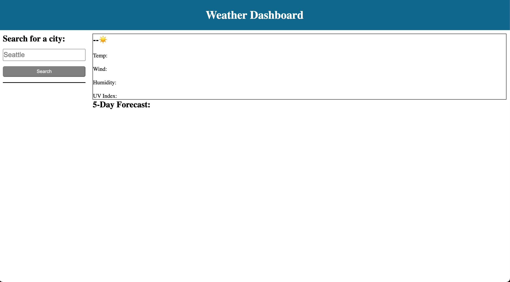
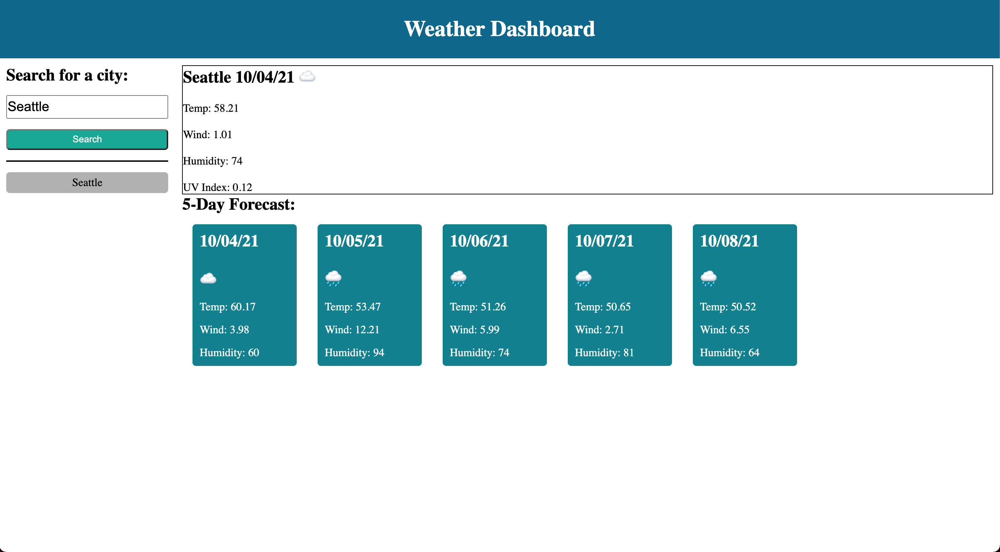

# Weather Dashboard

## About the application
Weather Dashboard is handy webpage were the user can search the weather in different cities. Once the user enters a valid city name and presses search, then the webpage displays the current weather, and the weather for the next 5 days. Lastly, the website also stores your previous search history.

## Deployment
Link to webpage: https://vitaliytrach.github.io/weather-dashboard/

Link to source code: https://github.com/vitaliytrach/weather-dashboard

## Screen shots

Before Search:

Before Search:
